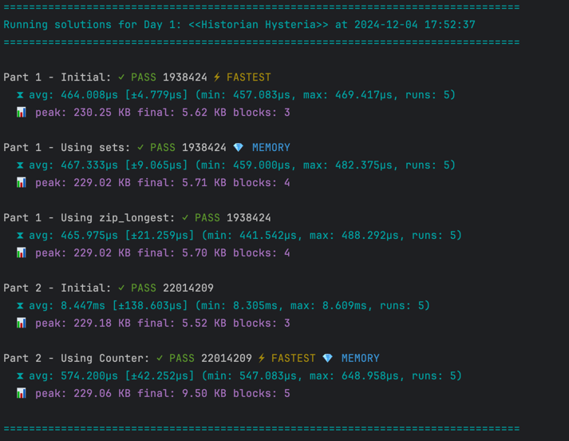

# Advent of code 🎄🧑‍💻
This repository contains my solutions for the [Advent of Code challenges](https://adventofcode.com/).

Supports multiple implementations and checks the performance and memory cost of each one.

## How to use
Just run `make check-problems` to check all problems for the current year.

Or if you prefer to run one day you can just:
```shell
python -m 2024.solutions.day1
```


Linting code is easy, just run `make lint` to check all the code. It runs `ruff` and `mypy`
```shell
make lint
```

## Structure
The repository is structured as follows:
```
.
├── 2024                # One folder per year of AoC
│   ├── data            # Input data for each problem
│   │   ├── day1
│   │   ├── day1-intro
│   ├── docs            # Description of each of the problems
│   │   ├── day1.md
│   ├── solutions       # Solutions for each problem
│   │   ├── day1.py
│   │   └── template.py
│   └── solutions.csv   # CSV file with all the values of the solutions
├── Makefile
├── README.md
├── pyproject.toml
├── requirements.txt
├── setup.cfg
└── tools
    ├── helpers.py
    └── problem.py
```
## Contributing
Contributions are welcome! Please open an issue or submit a pull request for any improvements or bug fixes.

## License
This project is licensed under the MIT License - see the license file for details.
